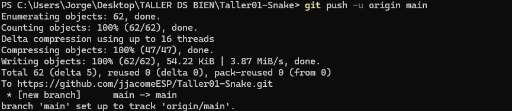
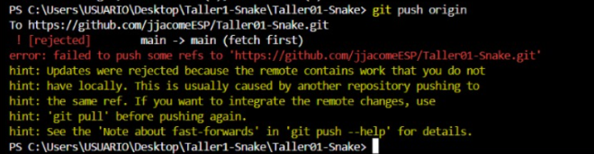
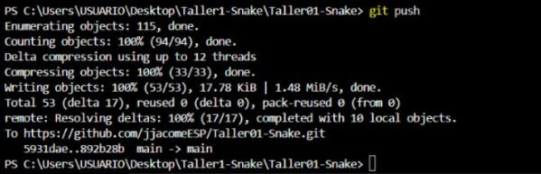
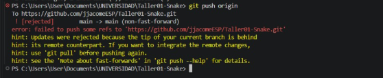
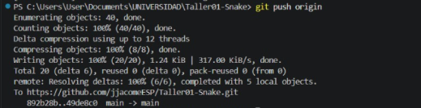

# Taller 01 - Git y Resolución de Conflictos

## Integrantes y roles

| Rol | Nombre | Usuario de GitHub | Commit principal |
| --- | --- | --- | --- |
| Líder | Jorge Eduardo Jacome Freire | jjacomeESP | Líder: personalizar botón y colores principales |
| Integrante 1 | Elkin Andre Garcia Loor | GarciaElkin | Integrante 1: cambiar botón y cabeza de snake |
| Integrante 2 | Ariana Domenica Sarmiento Mendoza | Ariana-SarMen | Integrante 2: cambiar botón y colector de gold |

## Evidencias

### Líder

Push exitoso:

### Integrante 1

Error al intentar realizar el push:

Push exitoso después de resolver los conflictos:

### Integrante 2

Error al intentar realizar el push:

Push exitoso después de resolver los conflictos:

## Repositorio

https://github.com/jjacomeESP/Taller01-Snake